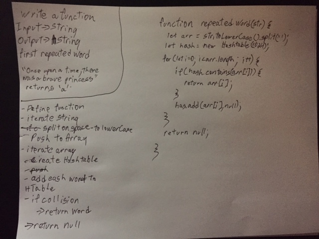

# Repeated Word

### Author: Jared 

### Links and Resources

* [repo](https://github.com/jaredpattison/data-structures-and-algorithms/tree/master/code-challenges/hashtable/repeatedWord)

# Write a function that accepts a lengthy string parameter.
Without utilizing any of the built-in library methods available to your language, return the first word to occur more than once in that provided string.

## Solution
