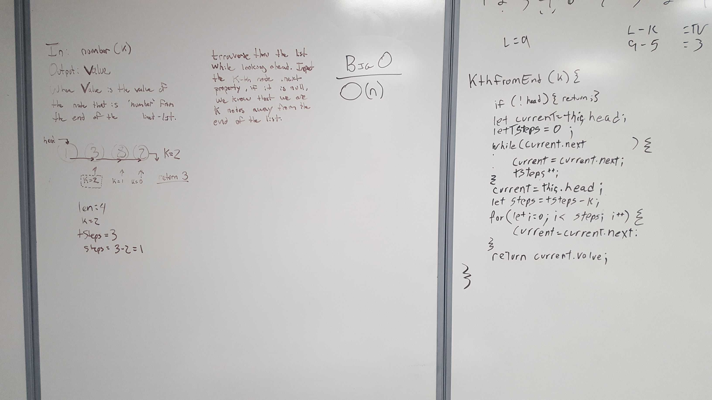

# Insert and Append functions for Link Lists
Write the following methods for the Linked List class:

.append(value) which adds a new node with the given value to the end of the list
.insertBefore(value, newVal) which add a new node with the given newValue immediately before the first value node
.insertAfter(value, newVal) which add a new node with the given newValue immediately after the first value node
.kthFromEnd(index)
You have access to the Node class and all the properties on the Linked List class.

## Challenge
Create a Node class that has properties for the value stored in the Node, and a pointer to the next Node.
Within your LinkedList class, include a head property. Upon instantiation, an empty Linked List should be created.
This object should be aware of a default empty value assigned to head when the linked list is instantiated.
Define a method called insert which takes any value as an argument and adds a new node with that value to the head of the list with an O(1) Time performance.
Define a method called includes which takes any value as an argument and returns a boolean result depending on whether that value exists as a Node’s value somewhere within the list.
Define a method called print which takes in no arguments and outputs all of the current Node values in the Linked List.
At no time should an exception or stack trace be shown to the end user. Catch and handle any such exceptions and return a printed value or operation which cleanly represents the state and either stops execution cleanly, or provides the user with clear direction and output.
Be sure to follow your language/frameworks standard naming conventions (e.g. C# uses PascalCasing for all method and class names).

## Approach & Efficiency
while loop to search for matching value (or next: null in case of append)

## Solution

### To-do list
- [x] Work in data-structures-and-algorithms
- [x] On branch: ll_kth_from_end
- [x] In folder: linkedList
- [x] On file: linked-list.js
- [x] Write test assertions for each method that you define.
- [x] Ensure your tests are passing before you submit your solution.
- [x] Create a pull request from your branch to your master branch
