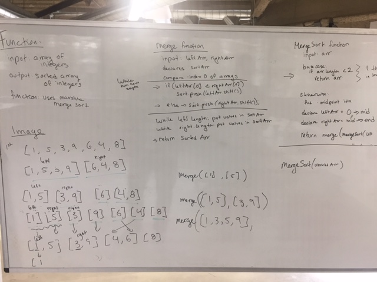

# Mergesort

# Jared

## Challenge
Write a function that accepts an array of unsorted integers, and returns a sorted array by a recursive mergesort algorithm.

## Approach & Efficiency
Recursivly split the array until each array is a length  of 1, then recursivly combinte the arrays, comparing the first index of each array

## Solution
