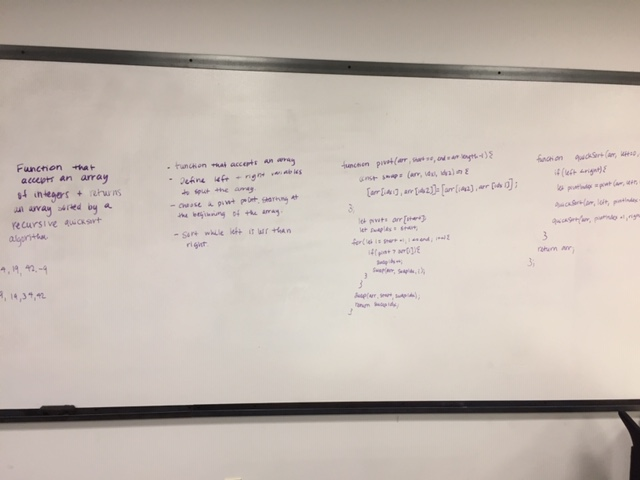

# Quicck sort

# Jared and Heather

## Challenge
Write a function that accepts an array of integers, and returns an array sorted by a recursive quicksort algorithm.

## Approach & Efficiency
Recursivly split the array until each array is a length  of 1, then recursivly combinte the arrays, comparing the first index of each array

## Solution
