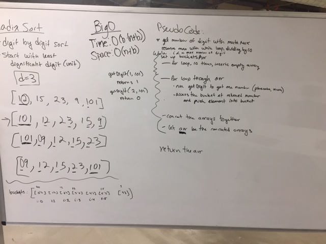

# Radix-sort

# Jared

## Challenge
Write a function that accepts an array of unsorted integers, and returns a sorted array with radix sort algorithm.

## Approach & Efficiency
a non-comparison based sorting algorithm where it grouping by the number place and position

## Solution
