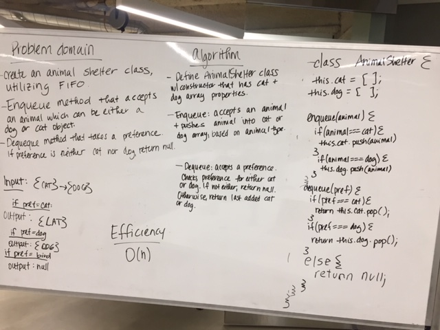

# fifoAnimalShelter
1/8/19 -- Code Challenge 12 - Heather and Jared

## Challenge
### Canvas instructions:  
* Create a class called AnimalShelter which holds only dogs and cats. The shelter operates using a first-in, first-out approach.
Implement the following methods:
enqueue(animal): adds animal to the shelter. animal can be either a dog or a cat object.
dequeue(pref): returns either a dog or a cat. If pref is not "dog" or "cat" then return null.

## Approach & Efficiency 
* Examined problem domain
* Visualization
* Formulated algorithm
* Wrote pseudoQueue function
* Wrote checks for function
* Identified Efficiency
* Wrote test assertions 

## Solution
